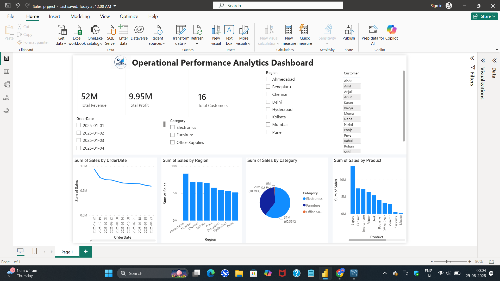

# Operational-Performance-Analytics-Dashboard
Interactive Power BI Dashboard using SQL, Excel, Power Query and DAX.
# 📌 Project Overview

This project demonstrates an end-to-end **Business Intelligence workflow**, starting from raw sales data and ending with an interactive Power BI dashboard.

The dashboard enables business users to:

- 📈 Monitor Sales Performance
- 💰 Track Revenue & Profit
- 👥 Analyze Customer Growth
- 🌍 Compare Regional Performance
- 📦 Evaluate Product Performance
- 📅 Analyze Monthly Trends

---

# 🛠️ Tech Stack

| Tool | Usage |
|------|-------|
| 📊 Power BI | Dashboard Development |
| 🗄️ MySQL | Data Storage & SQL Analysis |
| 📄 Excel | Raw Dataset |
| 🔄 Power Query | Data Cleaning & Transformation |
| 📈 DAX | KPI Calculations |

---

# 📂 Project Workflow

```text
Excel Dataset
      │
      ▼
Power Query
(Data Cleaning)
      │
      ▼
MySQL Database
      │
      ▼
SQL Analysis
      │
      ▼
Power BI
      │
      ▼
DAX Measures
      │
      ▼
Interactive Dashboard
```

---

# 📸 Dashboard Preview

<p align="center">

</p>

---

# 📊 Dashboard Highlights

## KPI Cards

- 💰 Total Revenue
- 📈 Total Profit
- 👥 Total Customers
- 📦 Total Orders

---

## Interactive Filters

- 📅 Order Date
- 🌍 Region
- 📦 Category
- 👤 Customer

---

## Visualizations

- 📈 Sales Trend
- 🍩 Sales by Category
- 📊 Sales by Region
- 📦 Product Performance

---

# 📈 Key Performance Indicators

| KPI | Description |
|------|-------------|
| 💰 Total Revenue | Overall Revenue |
| 📈 Total Profit | Net Profit |
| 👥 Customers | Unique Customers |
| 📦 Orders | Total Orders |
| 📊 Quantity | Products Sold |
| 📉 Profit Margin | Profit Percentage |

---

# ✨ Features

✔ Interactive Dashboard

✔ Dynamic Slicers

✔ Data Cleaning using Power Query

✔ SQL Data Analysis

✔ DAX Measures

✔ KPI Cards

✔ Business Insights

✔ Interactive Charts

---

# 📁 Repository Structure

```text
Operational-Performance-Analytics-Dashboard
│
├── Dashboard.png
├── README.md
├── Sales_dataset.csv
├── Sales_project.sql
├── Sales_project_dashboard.pbix
```

---

# 📚 Business Insights

The dashboard helps answer questions like:

- Which region generates the highest revenue?
- Which products perform best?
- What are the monthly sales trends?
- Which customers contribute the most revenue?
- Which category has the highest profit?
- How is operational performance changing over time?

---

# 💡 Skills Demonstrated

- Data Cleaning
- Data Transformation
- SQL Query Writing
- Power Query
- DAX Measures
- Data Visualization
- Dashboard Design
- Business Intelligence
- KPI Reporting
- Data Analytics

---

# 🚀 Future Improvements

- Forecasting
- Drill-through Reports
- Mobile Layout
- AI Visuals
- Map Visualizations
- Row-Level Security (RLS)

---

# 👨‍💻 Author

**Sharau Jagtap**

🎓 MCA Student

🔗 GitHub: https://github.com/sharau09

---

<div align="center">

## ⭐ Star this repository if you found it useful!

Made with ❤️ using **Power BI**
